## Chat with Graphs Intelligently

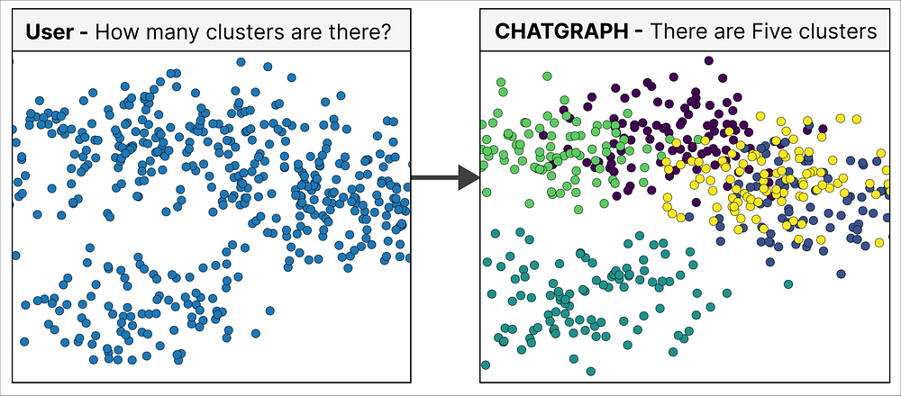

Graphs are one of the ways that provide important information about your data or your analysis on that data. However, most of the time, reading graphs is among the difficult tasks. How good would it be if you could use a [multimodal](https://blog.google/technology/ai/google-gemini-ai/) to understand your graphs and receive information that you cannot learn by just seeing it?

ChatGraph is a web app I have created for coders/non-coders that allows you to talk intelligently with graphs. We will look at each of its features here to understand what it can do and then test its capabilities.

other Projects:

* Create a Copilot inside your Notebook [link](https://levelup.gitconnected.com/create-copilot-inside-your-notebooks-that-can-chat-with-graphs-write-code-and-more-e9390e2b9ed8)
* Powerful NLP Library 2024 [link](https://medium.com/gitconnected/how-i-created-the-most-powerful-nlp-library-in-python-c26d08a55809)
* Building Million Parameter LLM [link](https://medium.com/gitconnected/building-a-million-parameter-llm-from-scratch-using-python-f612398f06c2)

<br>

## ChatGraph Demo: [chat-with-graph.streamlit](https://chat-with-graph.streamlit.app/)

## Run Locally

```bash
git clone https://github.com/FareedKhan-dev/ChatGraph
```

Go to the project directory

```bash
cd ChatGraph
```

Install dependencies

```bash
pip install -r requirements.txt
```

Get Gemini Multimodal API Key from [here](https://makersuite.google.com/app/apikey)


Replace your api key here

```python
# Configure the library with your API key
genai.configure(api_key="Your-API-Key-Here")
```

Start the server

```bash
streamlit run app.py
```

## Parameters table

| Parameter | Description | Default Value | at line no. |
| :--- | :--- | :--- | :--- |
| **Number of Questions** | Number of questions generated by enhanced AI feature | 20 | 178 |
| **Conversation History** | Number of messages displayed in the chat window | 10 to 30 | 100 |
| **AI Model** | AI model used for generating responses | 1 | 95 |


## IF Error Occurs

If AI feature is not working, then you need to remove this import
```python
from custom_ai import data_analyst_questions, nlp_engineer_questions, data_engineer_questions
```
and manually add the questions list, this is what the top of `app.py` should look like
```python
data_analyst_questions = [ ... ]
nlp_engineer_questions = [ ... ]
data_engineer_questions = [ ... ]
...

# Import necessary libraries
import google.generativeai as genai
import streamlit as st
...
```

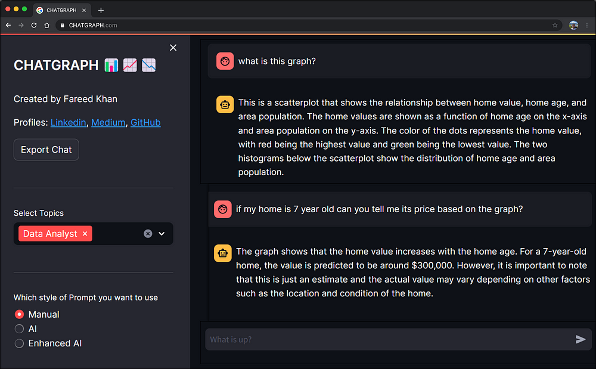

## Table of Contents

* [Enhanced AI Feature](#4b46)

* [Manual Chat Feature](#e697)

* [AI Chat Feature](#d6db)

* [How Accurate is ChatGraph?](#67eb)

## Enhanced AI Feature

This feature is useful when you’ve plotted a graph, but you don't know what kind of questions can be asked related to it. Enhanced AI comes in handy as it generates important questions related to the graph, which you can then ask.

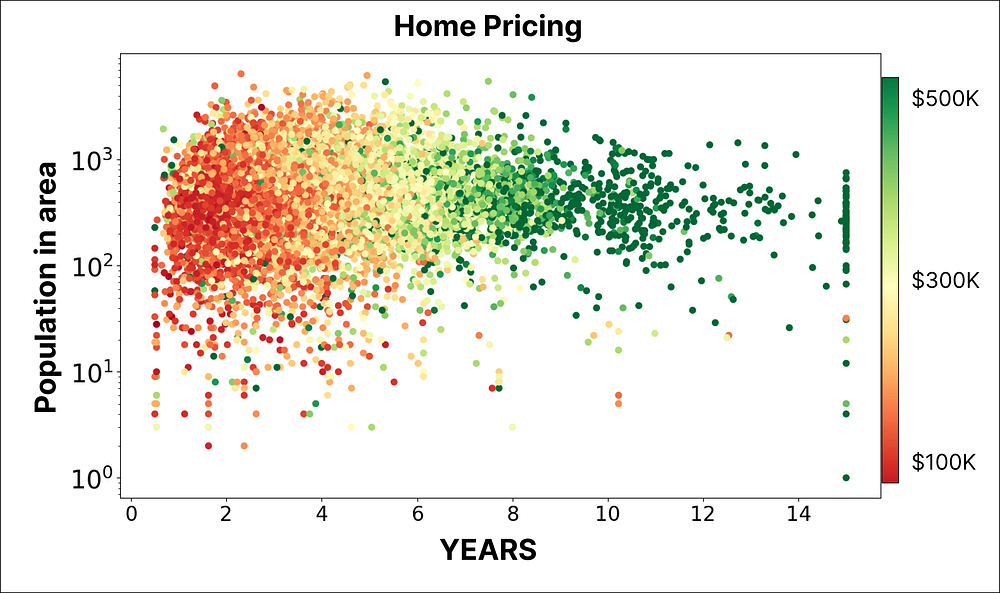

Consider the graph of home pricing, where the prices of houses depend on the age of the house and the population in that area. By just looking at the graph, you may already have some questions in your mind, such as: **“If my house is x years old and the population in the area is y, what could be the house price?”** Many more questions may come to mind, But thinking takes time. On the other hand, the enhanced AI feature can generate more than 20 important questions related to that graph within 5 seconds.


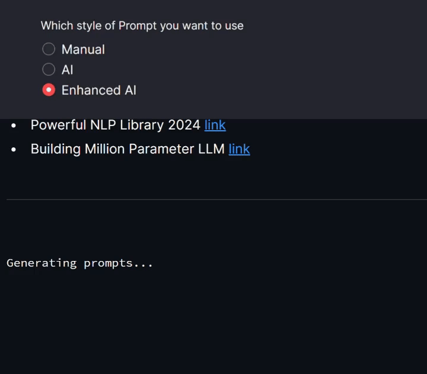

You can adjust the number of questions by changing the parameter. I’ve set it to 20 for the web app, but when running locally, you have the flexibility to access everything and increase the number of generated questions to 100, 200, or even more.


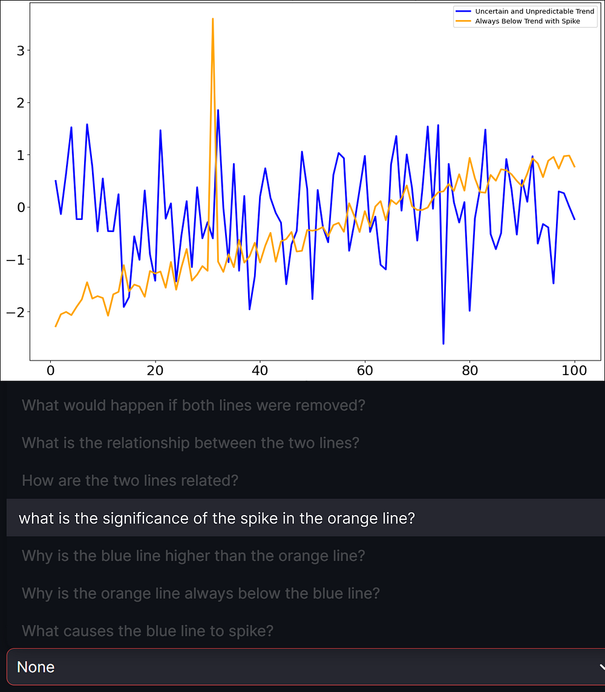

Here’s another example that demonstrates how the enhanced AI feature generates prompts for the graph, closely resembling the questions that come to mind when we initially see the graph or seek answers from it.

## Manual Chat Feature

This feature is quite similar to ChatGPT where you can ask custom questions, The interesting part is, every question and its response, whether from manual or enhanced ai chat, gets stored in the cache. This gives it a ChatGPT-like feel, where our entire conversation is saved for reference.


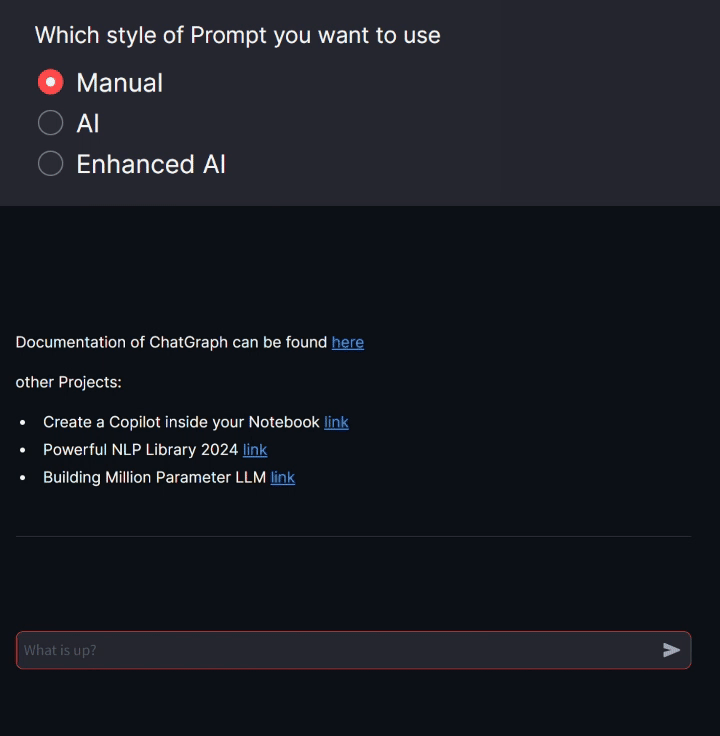

I’ve set the conversation history range between 10 to 30 (no. of messages), but similar to other parameters, you have the flexibility to adjust it based on your specific needs.


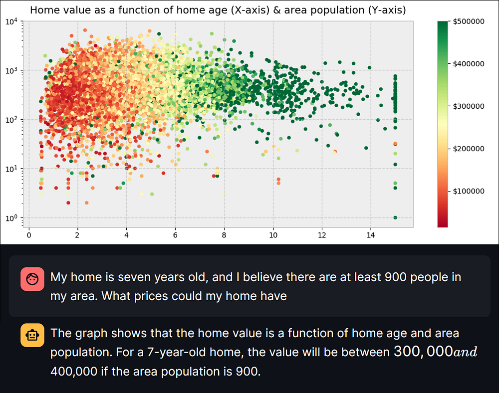

## AI Chat Feature

Most of the questions we ask related to graphs, whether for numerical or text data, are common among developers, such as identifying outliers, understanding the trend in a time series plot, or determining the number of clusters present. This AI feature has compiled over 250+ questions in a detailed manner under different categories such Data Analyst, NLP etc. This way, it provides descriptive questions based on your search query rather than short questions that may not offer sufficient information.


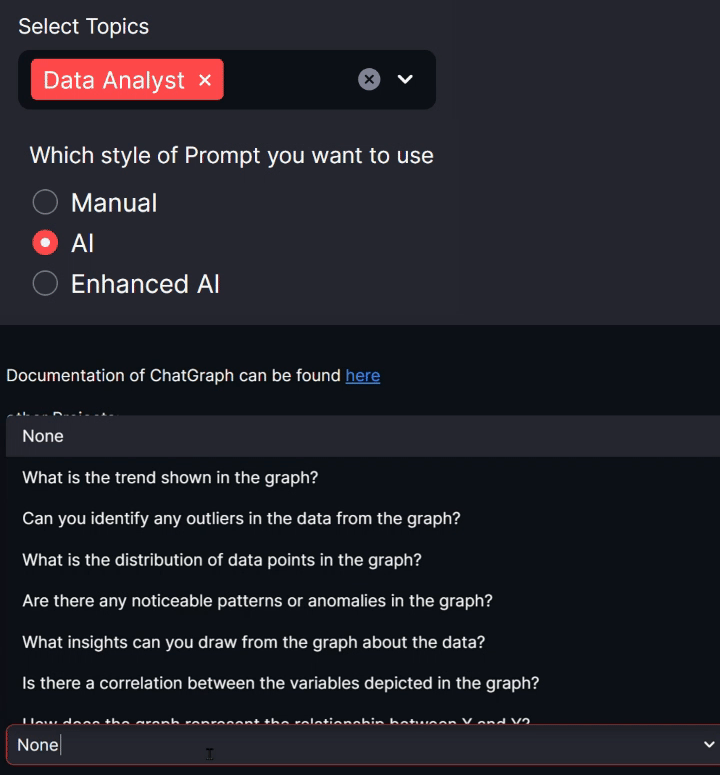

Now that we’ve had a brief overview of ChatGraph, the real test lies in how well it performs on different types of graphs. In the next section, we will evaluate its accuracy.

## How Accurate is ChatGraph?


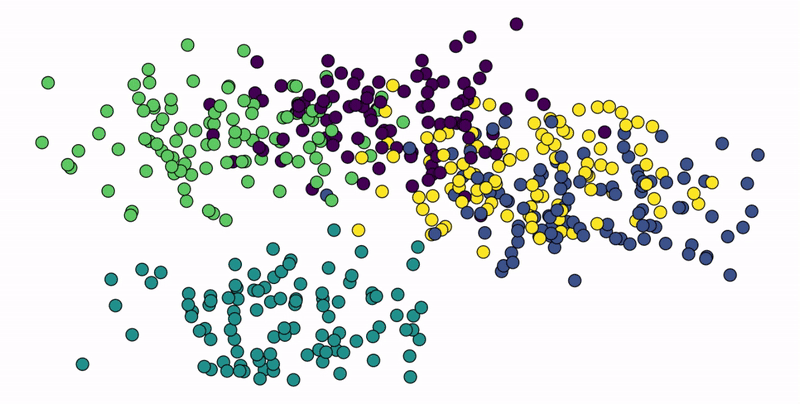

Consider this graph of different data points with some noise in it, I already know that there are 5 clusters present in it, I hide this information visually and ask ChatGraph how many cluster are present in this noisy data.

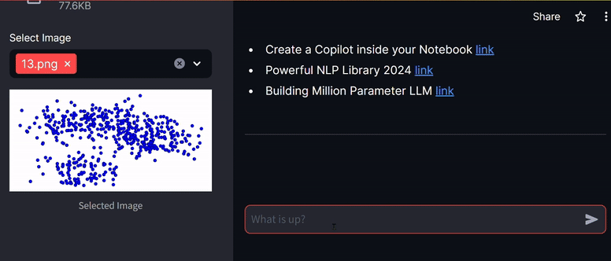

It correctly identifies the number of clusters present in this data, but it may not be as accurate in every condition, especially when dealing with a large number of data points. In my case, there are only 500 points.


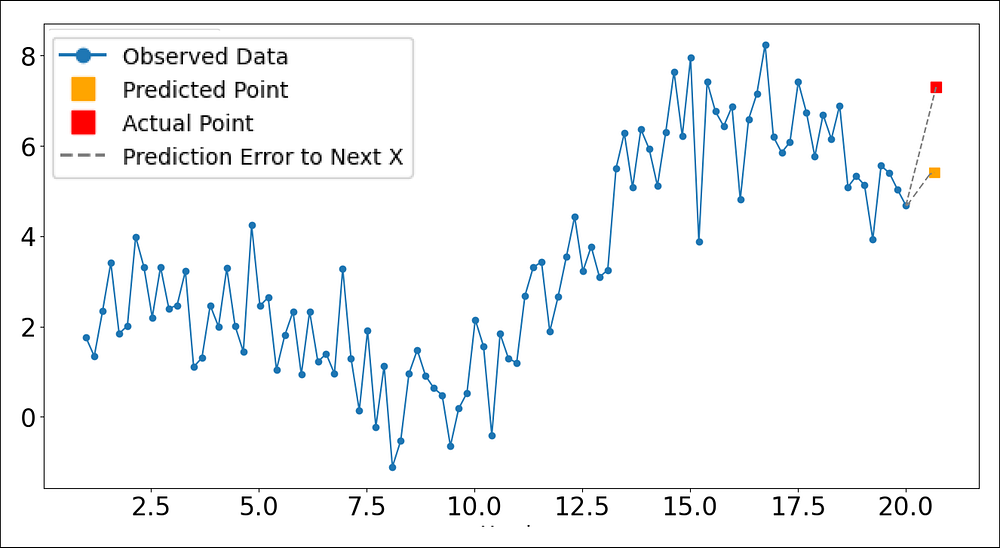

I made a line graph without a clear pattern. I hid the last predicted number 7.36 and asked ChatGraph to guess it. It guessed 5, which isn’t very close, but it did recognize that the trend suggests an increase in the values.


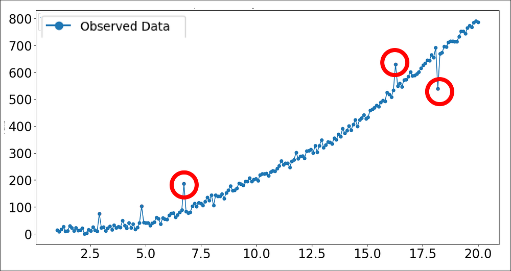

In this graph, I intentionally created three extreme outliers at **[6.4, 16.7, 18.1]**, and I asked ChatGraph to detect it. It’s predicted x values are **[6.5, 16.5, 18.5] **which are almost equal to true values, but providing additional information can yield a more descriptive answer, such as explaining why these outliers exist and so on.


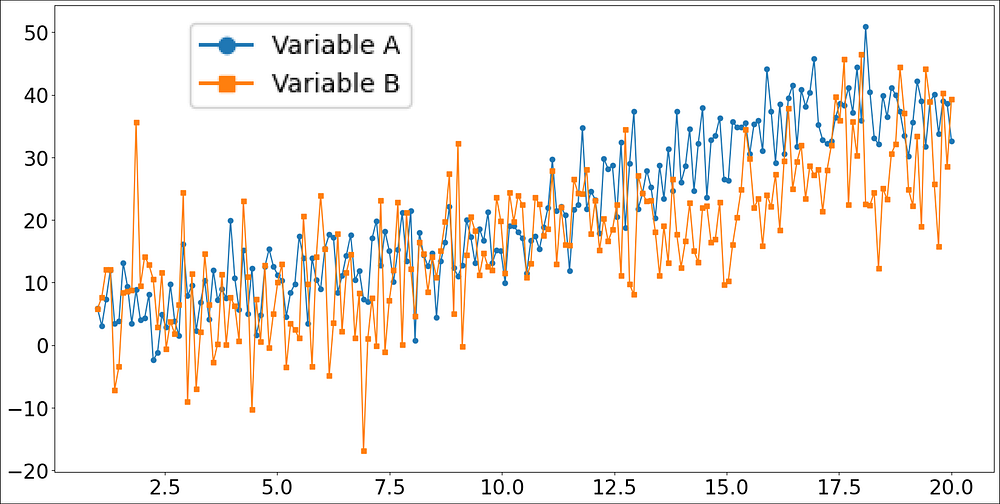

To determine whether it can understand relationship between variables, I plotted a graph where both variables initially show a positive correlation at the 12.5 value but have a different relation afterward. I then asked ChatGraph to understand the relationships between these variables.
>  User Query —  **Do Variable A and Variable B show a consistent correlation over the entire time period?        
> 
>  ChatGraph — No, the correlation between the two variables is not consistent over the entire time period. While there is a positive correlation between the two variables for the first half of the time period, there is a negative correlation between the two variables for the second half of the time period.


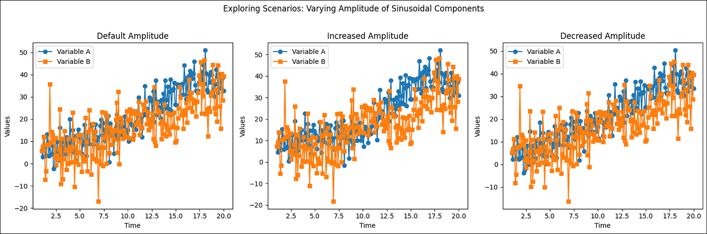

To verify if ChatGraph can find the impact of one variable over the other, I plotted a graph where increasing the amplitude value results in a more complex pattern, while decreasing its value makes the overall relationship less complex. Let’s see if ChatGraph can observe and understand this behavior.

>  User Query —  **how changing the amplitude affects the overall patterns and complexity in the relationship between Variable A and Variable B over time?
> 
>  ChatGraph — The amplitude of a signal, like sinusoidal components, affects the intensity of fluctuations in variables over time. Higher amplitude magnifies differences, making relationships complex. Lower amplitude simplifies relationships by reducing fluctuations. In summary, amplitude acts as a magnifier, influencing the complexity and dynamics of the relationship between variables.


Instead of posing a question, let’s observe what insights ChatGraph can derive from the above graph on its own.

Here are a few insights extracted by ChatGraph:

* The home value increases with the home age and area population.

* The home value is mostly affected by the area population.

* The home value is less affected by the home age.

* Most homes are valued between $100,000 and $300,000.

* Most homes are between 0 and 50 years old.

* The graph can predicts home value using age and local population. For example, 20-year-old home in a 10,000 people area is valued around $200,000.

## What’s next?

Certainly, there are numerous possibilities with ChatGraph, and you can customize the web app according to your specific needs. This includes changing the prompt structure or adjusting the history parameters to a higher value. I’ve written another article on creating a copilot inside your notebook, which includes a feature for chatting with graphs while coding. You can find it here:

 [**Create a Copilot inside your notebooks that can chat with graphs, write code and more**](https://levelup.gitconnected.com/create-copilot-inside-your-notebooks-that-can-chat-with-graphs-write-code-and-more-e9390e2b9ed8)
